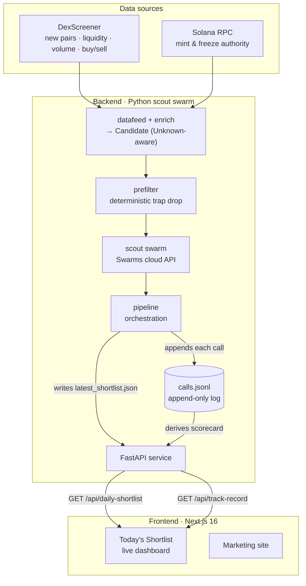
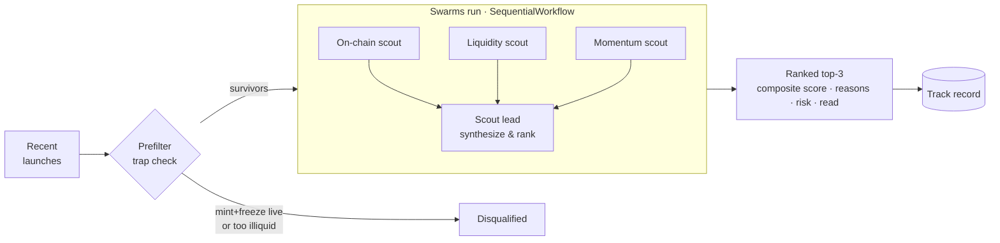

<div align="center">


# Meridian

### The discovery layer for Solana launches.

A swarm of specialized scout agents that continuously scans new Solana token
launches, scores each against a transparent rubric, and surfaces the few worth
investigating today — with a public, running track record of every call.

<br/>


`$MRDN` · built for **Agent Capital Markets** · *worth investigating, never financial advice*

</div>

---

## Table of contents

- [The thesis](#the-thesis)
- [Why this wins](#why-this-wins)
- [Architecture](#architecture)
- [How the swarm scores a launch](#how-the-swarm-scores-a-launch)
- [The scout swarm](#the-scout-swarm)
- [The scoring rubric & honesty model](#the-scoring-rubric--honesty-model)
- [The track record — the moat](#the-track-record--the-moat)
- [API contract](#api-contract)
- [Tokenomics — `$MRDN`](#tokenomics--mrdn)
- [Repository](#repository)
- [Quickstart](#quickstart)
- [Deployment](#deployment)
- [Tech stack](#tech-stack)
- [Roadmap](#roadmap)

---

## The thesis

Hundreds of tokens launch on Solana every day; the overwhelming majority are
noise or traps. The hard part for a trader isn't evaluating a token they've
*already found* — it's **finding the few worth evaluating in the first place**,
fast, before the move. That discovery work is currently manual and scattered
across new-pair scanners, wallet trackers, and Twitter.

Today's leading agent answers *"is this token I already found safe?"*
**Meridian answers the question that comes before it: "which tokens should I
even be looking at right now?"**

## Why this wins

| | One-shot due-diligence | **Meridian** |
|---|---|---|
| **Job** | Evaluate a token you bring | Discover tokens you didn't know about |
| **Stance** | Defensive — "is it safe?" | Offensive — "where's the edge?" |
| **Cadence** | One-shot, on demand | Daily, recurring |
| **Memory** | None | Public, running track record |
| **Reason to return** | Weak — use once, flip | Strong — the next call is tomorrow |
| **Viral engine** | A single verdict screenshot | A track record that compounds |

That single shift — from reactive evaluation to proactive discovery — is the
product. The **public track record** is the moat: one-shot tools structurally
can't have one, and an honest record of wins *and* misses is the cheapest, most
credible marketing in crypto.

## Architecture

A clean two-tier split: a Python swarm service does the slow, credit-bearing
reasoning and writes artifacts; a FastAPI layer only *reads* those artifacts, so
the website stays fast and cheap.



## How the swarm scores a launch

Candidates are deterministically pre-filtered (obvious traps never reach the
swarm), then a **real Swarms multi-agent run** scores the survivors: three
specialist scouts each reason over only the signals they can verify, and a lead
synthesizes them into a ranked shortlist.



> The swarm runs on Swarms infrastructure via `SWARMS_API_KEY` (zero-cost under
> Frenzy Mode) — **no OpenAI/model-provider key required**. A deterministic
> `MockScoutSwarm` mirrors the same interface so the whole pipeline is testable
> without spending credit.

## The scout swarm

| Scout | Watches | Surfaces / flags | Status |
|---|---|---|---|
| **On-chain** | Mint authority, freeze authority, pair age | Disqualifies obvious traps; flags un-renounced authorities and very young pairs | ✅ live |
| **Liquidity** | Pool size (USD), liquidity-to-FDV ratio | Filters illiquid / exit-rug setups | ✅ live |
| **Momentum** | Volume slope (1h/6h/24h), buy/sell transaction pressure | Surfaces early traction before it's obvious | ✅ live |
| **Smart-money** | Notable / clustered wallet entries | The "who's already in" signal | 🔜 v1.5 |
| **Scout lead** | All scout outputs | Synthesizes the ranked shortlist + rationale | ✅ live |

## The scoring rubric & honesty model

Each pick carries a **composite score (0–100)**, a per-scout breakdown, the two
strongest reasons it surfaced, the single standout risk, and a one-line
plain-English read. The honesty rules are baked into every agent's system prompt
and are the product's reason to exist:

1. **Unknown is Unknown.** If a signal can't be verified from the data, it's
   marked `Unknown` and down-weighted — never invented. Missing fields are
   passed to the agents as an explicit sentinel so they *can't* hallucinate them.
2. **"Worth investigating," never "buy."** Every pick is framed as research, not
   advice.
3. **Always name the standout risk.** Omitting it is a scoring error.
4. **Absence of evidence is a mild negative**, not a neutral.

## The track record — the moat

Every call is written to an **append-only `calls.jsonl`** log with a timestamp
and the score it was given. The public scorecard (hit / miss / open + hit-rate)
is *derived* from that log — so a miss can never be silently dropped. **The
record is honest by construction**, which is exactly what a one-shot
due-diligence tool structurally cannot offer.

## API contract

The frontend consumes two read-only endpoints (full schema in
[`backend/README.md`](backend/README.md)).

**`GET /api/daily-shortlist`**

```jsonc
{
  "generated_at": "2026-05-26T18:00:00Z",
  "as_of_date": "2026-05-26",
  "data_source": "dexscreener+solana-rpc",
  "disclaimer": "Not financial advice. Every pick is 'worth investigating', never 'buy'.",
  "free_tier_cutoff": 1,
  "picks": [
    {
      "rank": 1,
      "token": { "name": "Solaris", "symbol": "SOLR", "address": "…", "pair_url": "https://dexscreener.com/solana/…" },
      "composite_score": 90,
      "scores": { "onchain": 90, "liquidity": 90, "momentum": 90, "smart_money": null },
      "top_reasons": ["LP healthy vs FDV", "Buy/sell pressure 3.1x over 1h"],
      "standout_risk": "Pair only 5h old — unproven",
      "one_line_read": "Liquid, clean, and buyer-led — worth investigating.",
      "metrics": { "liquidity_usd": 42000, "age_hours": 5, "buy_sell_ratio_h1": 3.1, "mint_authority": "renounced" },
      "unknowns": ["smart_money"]
    }
  ]
}
```

**`GET /api/track-record`** → `{ updated_at, summary: { total_calls, hits, misses, open, hit_rate }, calls: [...] }`

## Tokenomics — `$MRDN`

Because the core utility is *daily and recurring*, holding is rational rather
than purely speculative — the defense against the churn that one-shot tools see.

| Tier | What you get |
|---|---|
| **Free** | A delayed / partial shortlist — enough to prove the product works |
| **Holder (`$MRDN`)** | The full ranked shortlist in real time + the live track record |

Listed as a **tokenized prompt** on the Swarms Marketplace via Frenzy Mode. The
product *is* the marketing: each day's call is content, and the running track
record compounds into receipts. *(Hold-to-unlock gating ships with the
roadmap below.)*

**Live on Solana** — `$MRDN` is minted and trading:

| | |
|---|---|
| Mint (CA) | [`G7L2LRZyoE6FZgFo51Betj88UPMdnNi1iYmBrpfpswrm`](https://solscan.io/token/G7L2LRZyoE6FZgFo51Betj88UPMdnNi1iYmBrpfpswrm) |
| Pool | [`Ha8Gs6P4BZAu3iu6ZAZj2PoA9xkA1Lf5mum5FjsdtnHh`](https://solscan.io/account/Ha8Gs6P4BZAu3iu6ZAZj2PoA9xkA1Lf5mum5FjsdtnHh) |
| Supply | 1,000,000,000 |

## Repository

| Path | What it is |
|---|---|
| [`backend/`](backend) | Python scout swarm — datafeed, scoring, Swarms agents, track record, FastAPI ([README](backend/README.md)) |
| [`frontend/`](frontend) | Next.js 16 marketing site + the live `/demo` shortlist dashboard |
| [`DEPLOY.md`](DEPLOY.md) | Deploy the backend (Render/Docker) and frontend (Vercel) |

## Quickstart

### 1 · Backend — the swarm + API

```bash
cd backend
python3 -m venv .venv
.venv/bin/pip install -e ".[dev]"
cp .env.example .env                 # add SWARMS_API_KEY

# Generate a shortlist (writes data/latest_shortlist.json + appends data/calls.jsonl)
.venv/bin/python -m meridian.run            # mock swarm + live DexScreener data
.venv/bin/python -m meridian.run --live     # real Swarms swarm
.venv/bin/python -m meridian.run --demo     # synthetic data, no network

# Serve it
.venv/bin/uvicorn meridian.api.server:create_app --factory --port 8000

# Tests (mock swarm — no credit spent)
.venv/bin/pytest
```

### 2 · Frontend — the site + dashboard

```bash
cd frontend
npm install
echo "NEXT_PUBLIC_MERIDIAN_API_URL=http://localhost:8000" >> .env.local
npm run dev                          # http://localhost:3000  →  /demo
```

The `/demo` page server-fetches the live shortlist and track record and
**degrades gracefully** to an "awaiting scan" state if the API is unreachable.

## Deployment

Backend → Render (Docker, `backend/Dockerfile`); Frontend → Vercel (root dir
`frontend`, set `NEXT_PUBLIC_MERIDIAN_API_URL` to the hosted backend URL).
Step-by-step in [`DEPLOY.md`](DEPLOY.md).

## Tech stack

**Backend** — Python 3.11+, [Swarms](https://github.com/kyegomez/swarms)
multi-agent (cloud API), FastAPI, httpx, Pydantic. Data from DexScreener + a
single Solana RPC call.

**Frontend** — Next.js 16, React 19, TypeScript, Tailwind CSS v4, Motion.

## Roadmap

**Shipped (v1)** — live launch datafeed, deterministic prefilter, real Swarms
scout swarm (on-chain · liquidity · momentum → synthesizing lead), append-only
track record with a derived scorecard, FastAPI service, and the full frontend
with a live shortlist + track-record dashboard.

**Next** — dedicated smart-money scout, automated track-record outcome updates
across the judging window, `$MRDN` hold-to-unlock gating, real-time push alerts,
and wallet connect.

---

<div align="center">

**Every pick is framed as *worth investigating* — never financial advice.**

Meridian discovers; it does not advise. Holders make their own decisions.

</div>
